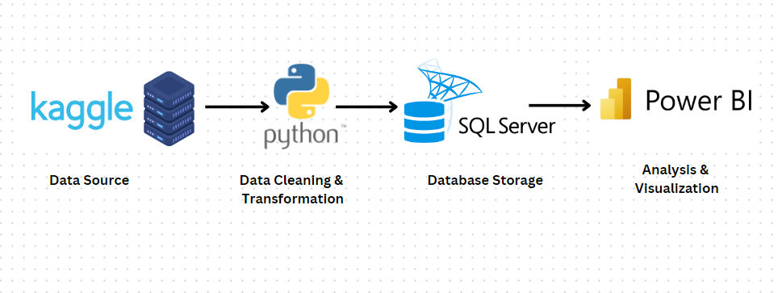
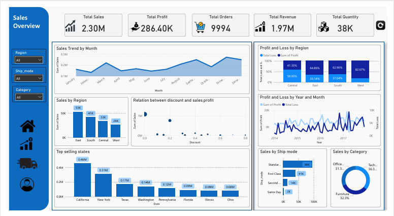
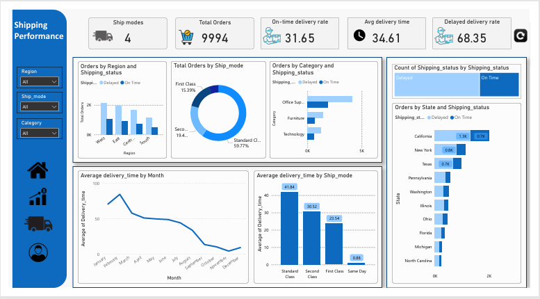
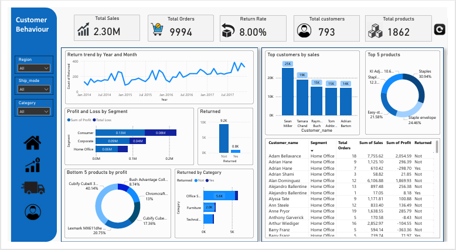

# Retail-Supply-Chain-Sales-Analysis

## Project Overview
This project is an end-to-end data analysis solution designed to extract business insights from Retail sales data.
project aims to analyze Retail sales trends, customer behavior, and shipping performance to optimize pricing strategies, logistics operations, and customer retention through data-driven insights. I utilize Python for data cleaning and exploratary data analysis,processing,SQL for storing data and PowerBi for creating interactive dashboards.

---

## Project Architecture
--- 

## Project Steps

---
**1. Set Up the Environment**

**Tools Used**:
- Python
- Jupyter notebook
- SQL Server Management Studio(SSMS)
- Power BI

---

**2.Load Data**

Loading Data: 
Read the data into a Pandas DataFrame for initial analysis and transformations

--- 

**3.Explore the Data**

Use functions like .info(), and .head() to get a quick overview of the data structure .

---

**4.Data Cleaning**

Handle Missing Values:  fill values where in some columns where there is missing.

---

**5.Feature Engineering**

**Python**

Creating the new columns: 
- Delivery time
- Shipping status
- Revenue

---

**6.Load Data into SQL Server**

- Set Up Connections: Connect to SQL Server using Pyodbc and load the cleaned data into database.
- Table Creation: Create and insert the data into SQL Server using pyodbc.

---

**7.Data Visualization in Power BI**

Connected SQL Server to Power BI for dynamic dashboards.

---

## Data Transformation

- Create Date Table = For  time based analysis .
- Data modeling- Date table and Retail sales table .
- Created some measures using DAX for KPI’s

                                      1) Total orders                 2) Total Loss  
                                      3) On-time delivery rate        4) Delayed delivery rate    
                                      5) Return rate      

- Created interactive charts and dashboards for sales, profit, shipping performance, and customer behavior.

---

## Requirements

- Python 3
- Jupyter notebook
- Python Libraries: Pandas, NumPy, Matplotlib, Seaborn, Pyodbc
- SQL Databases:SQL Server Management Studio (SSMS)
- Visualization Tool: Power BI

---

## Key Insights

1) Sales Performance: California, New York, and Texas contribute the highest sales, while November & December see peak demand.
 
2) Profit & Discounts: High discounts (above 30%) reduce profitability, and the South region has the highest loss percentage (58.65%).
   
3) Shipping Performance: 68.35% of orders faced delays, with Standard Class having the longest delivery time (41.84 days).
   
4) Customer Behavior: 8% of total sales were returned, with Office Supplies having the highest return rate.

---
## Acknowledgement

This project is part of my internship at quantum learnings: [Certificate](https://drive.google.com/file/d/1U-9LPkUYoe5w_ulkhWfbYy88J4GF1hVI/view?usp=drive_link)

---

## Power Bi dashboards

---

---

---

